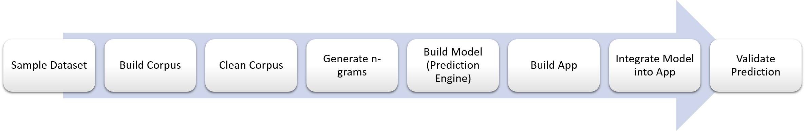
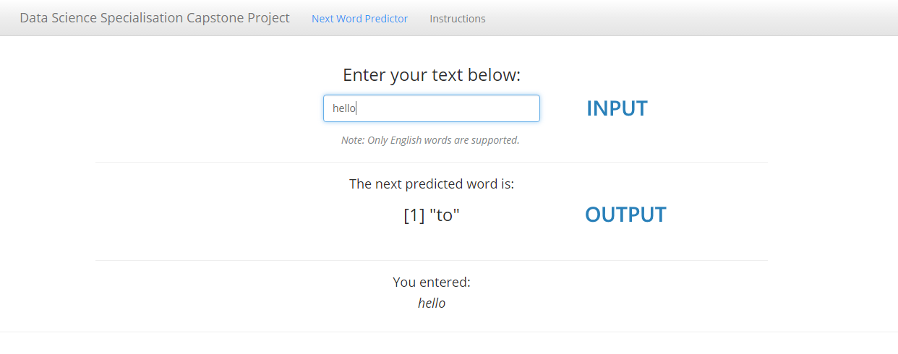

## Data Science Specialization Capstone Project

The goal of this project is to develop a predictive keyboard application that takes in a phrase and outputs a prediction of the next word.

--- ds:noborder

## Data Source

- The training dataset comes from a corpus called [HC Corpora](http://www.corpora.heliohost.org). It consists of three files containing unstructured data from blogs, news articles and tweets from Twitter.

- This dataset was first sampled and processed to generate the n-grams required.

- The n-grams were then used to build a prediction engine for the app.

- Summary of workflow:

--- ds:noborder

## App

- Hosted at this [link](https://outrigger.shinyapps.io/shiny_app/)
- Wait for the app to load. Once done, "[1] NA" will appear as the next predicted word.
- Enter a phrase in the textbox provided and the next predicted word will be generated.
- Screenshot:

---

## Algorithm

- Katz back-off model
    - Katz back-off is a generative n-gram language model that estimates the conditional probability of a word given its history in the n-gram.
    - It accomplishes this estimation by "backing-off" to models with smaller histories under certain conditions.
    - By doing so, the model with the most reliable information about a given history is used to provide better results.

---

## Implementation

- Example: 
    - Suppose that a 4-grams model is used to calculate the probability of the next word.
    - We have the phrase "a case of beer for a" followed by "dollar".
    - Let's say "dollar" never occurred in the context "a case of beer for a", hence the 4-grams model "dollar" has a probability of 0.
    - We then apply back-off which means going back to the (n - 1)-grams level to calculate the probabilities when we encounter a word with probability = 0.
    - In this case, we will use a 3-grams model to calculate the probability of "dollar" in the context "case of beer for a".
